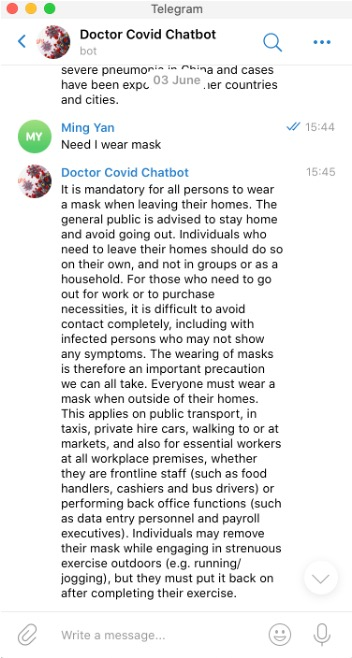
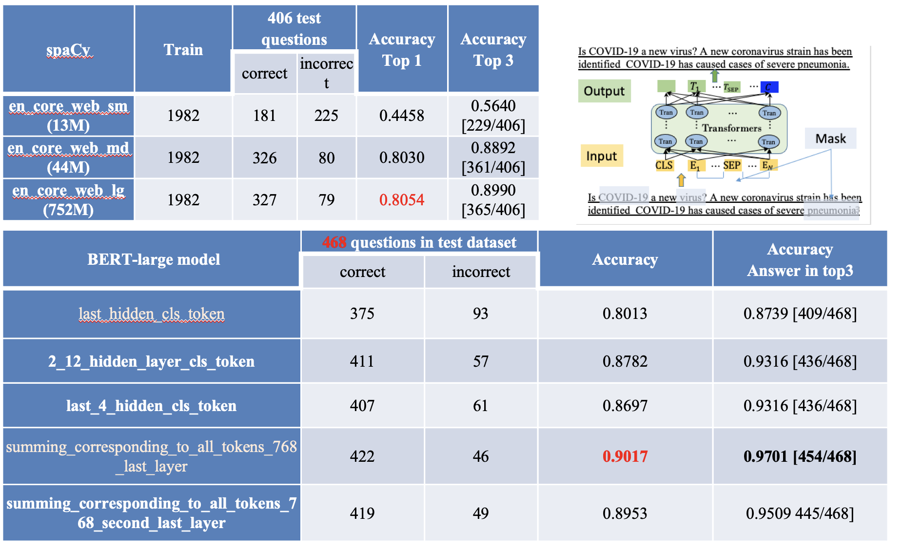
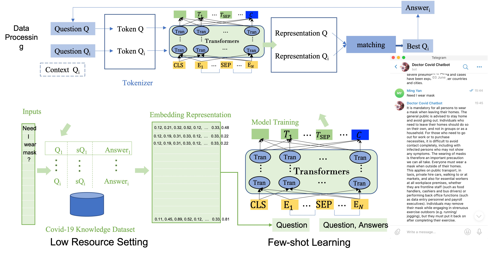

# Dr.Covid Telegrame Demo
* DrFAQ is a FQA demo for Dr COVID (2020), full version will be released.
* Designed and implemented a NLP Question Answering architecture using spaCy, BERT language model, ElasticSearch, and Telegram Bot API.
* DOCTOR COVID applied to SingHealth at Singapore EXPO and D’Resort with more information from [News of Dr.COVID](https://www.a-star.edu.sg/News/a-star-news/news/press-releases/singhealth-and-a-star-co-developed-smart-chatbot-to-enhance-care-for-covid-19-patients-at-community-care-facilities).


# Requirement
```
pip install python-telegram-bot
pip install 
```
* Prepare a FAQ csv corpus, we have some demo in [/match](/match) 

# Demo 

Telegrame Demo Screenshot



# Spacy/BERT Comparison Results


# Pipeline
When a question is asked, the following processes are performed:
1. FAQ Question Matching using spaCy's Similarity - [/match](/match)
2. NLP Question Answering using huggingface's BERT - [/nlp](/nlp)

<!-- 3. Answer Search using ElasticSearch - [/search](/seach) 
    * If the answer is not sufficiently confident, perform a search on the document corpus and return the search results.
4. Human Intervention 
    * If the search results are still not relevant, prompt a human to add the question-answer pair to the existing list of specified FAQs, or speak to a human. -->

<!-- * Due to Heroku's free tier limits, only FAQ Question Matching using spaCy's Similarity and Answer Search using ElasticSearch functions are enabled. -->

# To do list
1. Update BERT model and pipeline 2
2. Transformer-based Close domain search
3. Support WhatApp & Wechat 
4. Answer Search using ElasticSearch 

The BERT-based Pipeline



# References
* [explosion/spaCy](https://github.com/explosion/spaCy) - Industrial-strength Natural Language Processing (NLP) with Python and Cython
* [huggingface/transformers](https://github.com/huggingface/transformers) - Transformers: State-of-the-art Natural Language Processing for TensorFlow 2.0 and Pytorch
* [elastic/elasticsearch-py](https://github.com/elastic/elasticsearch-py) - Official Python low-level client for Elasticsearch
* [python-telegram-bot/python-telegram-bot](https://github.com/python-telegram-bot/python-telegram-bot) - Python Wrapper for Telegram Bots
* [google-research/bert](https://github.com/google-research/bert) - TensorFlow code and pre-trained models for BERT
* [BERT](https://arxiv.org/abs/1810.04805) - Pre-training of Deep Bidirectional Transformers for Language Understanding
* [DrQA](https://github.com/jetnew/DrFAQ) Telegrame demo for FAQ
